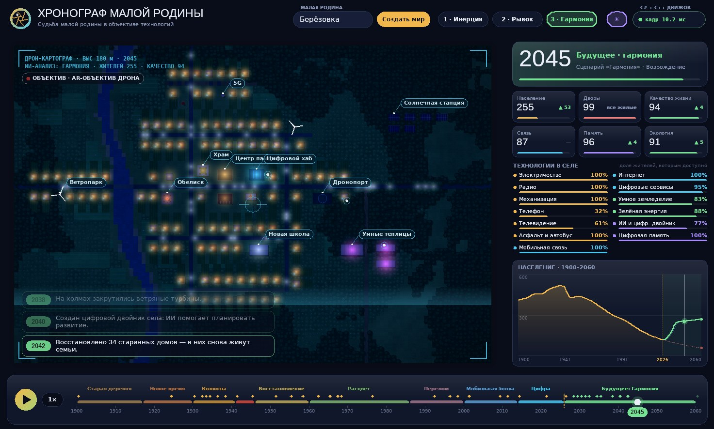
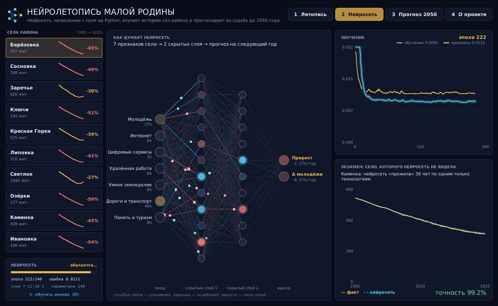
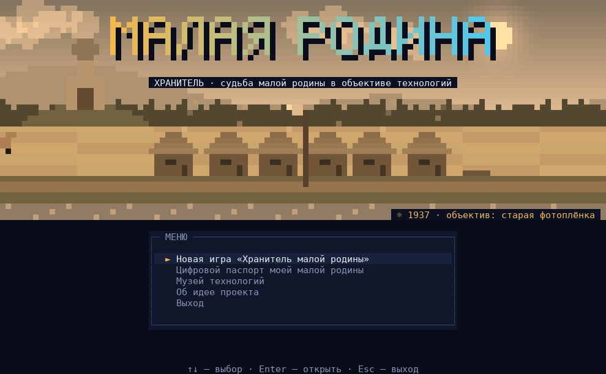

# Судьба малой родины в объективе технологий

Три варианта конкурсного проекта — три языка, три разных взгляда на одну тему.
У каждого варианта есть файл **ИДЕЯ.md** (текст для конкурса) и **README.md** (как запустить).

| | Вариант 1 · C# + C++ | Вариант 2 · Python | Вариант 3 · C# |
|---|---|---|---|
| Название | **Хронограф малой родины** | **Нейролетопись малой родины** | **Хранитель малой родины** |
| Жанр | интерактивная «машина времени» | нейросеть-аналитик | игра-квест в консоли |
| Суть | 160 лет жизни села на карте: 1900–2060, три сценария будущего | нейросеть учится на истории сёл района и прогнозирует судьбу до 2050 | 9 эпох — 9 решений, 5 финалов; паспорт своего села |
| «Объектив технологий» | каждая эпоха показана камерой своего времени: плёнка, «Свема», «мыльница», смартфон, AR‑дрон | нейросеть как новый «объектив», через который видны закономерности | панорама в сепии, «Свеме» и AR‑голограммах |
| Изюминка | C++ движок: генерация карты по названию села, симуляция, обработка кадра в реальном времени | нейросеть **с нуля** на чистом Python + объяснимый ИИ | пиксельная графика в консоли (16 млн цветов), HTML‑летопись и паспорт |
| Запуск | `Hronograf.sln` → F5 или `build.bat` | `python main.py` | `запуск.bat` или `dotnet run` |
| Нужно | Windows, .NET 8 (+ C++ в Visual Studio по желанию) | Python 3.8+ | .NET 8 |

```
variant1-csharp-cpp-hronograf/   C# (WinForms) + C++ (DLL)
variant2-python-neuroletopis/    Python (Tkinter) + нейросеть с нуля
variant3-csharp-hranitel/        C# (консоль, .NET 8)
```

## Скриншоты

**Вариант 1 — Хронограф** (2045 год, сценарий «Гармония», ночь)


**Вариант 2 — Нейролетопись** (нейросеть обучается и сдаёт экзамен)


**Вариант 3 — Хранитель** (главное меню)


## Общая мысль всех трёх проектов

Технологии сами по себе не спасают и не губят малую родину. Решает то, работают ли они на людей — и сохраняют ли память о прошлом.
